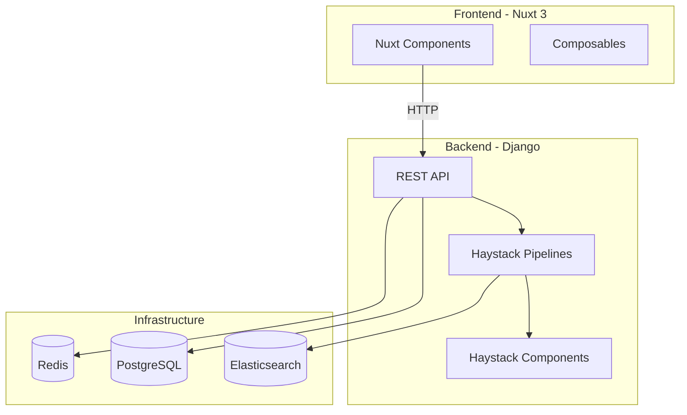

# AI-SDK-HAYSTACK

[](https://github.com/mk-knight23/AI-SDK-ECOSYSTEM)
[](https://haystack.deepset.ai/)
[](https://nuxt.com/)
[](https://www.djangoproject.com/)

> **Framework**: Haystack (Document AI & Extractive QA)
> **Stack**: Nuxt 3 + Django

---

## 🎯 Project Overview

**AI-SDK-HAYSTACK** demonstrates industrial document AI with extractive question answering and hybrid retrieval. It showcases Haystack 2.0 for building production search systems, RAG pipelines, and document intelligence applications.

### Key Features

- 🔍 **Extractive QA** - Pinpoint answers in large documents
- 📄 **Document Processing** - PDF, DOCX, TXT parsing
- 🎯 **Hybrid Retrieval** - BM25 + DPR for optimal results
- 🔗 **Elasticsearch** - Scalable document storage
- 🔄 **RAG Pipeline** - Production retrieval-augmented generation
- 🤖 **CrewAI Marketing Crew** - AI-powered marketing campaign generation

---

## 🛠 Tech Stack

| Technology | Purpose |
|-------------|---------|
| Nuxt 3 | Frontend framework |
| Django | Backend API |
| Haystack 2.0 | AI framework |
| Elasticsearch | Document search |
| Naive UI | Components |
| Celery | Background tasks |

---

## 🚀 Quick Start

```bash
# Frontend
cd frontend && npm install && npm run dev

# Backend
cd backend && python manage.py migrate && python manage.py runserver
```

---

## 🤖 CrewAI Marketing Crew

The marketing crew uses 4 specialized AI agents to generate comprehensive marketing campaigns:

### Agents
1. **ContentStrategist** - Develops content strategy and messaging framework
2. **Copywriter** - Creates compelling copy for email, social, ads, and landing pages
3. **SEOExpert** - Optimizes content for search engines with keywords and metadata
4. **CampaignManager** - Coordinates all activities into a cohesive execution plan

### Usage

```bash
# Install CrewAI (added to requirements.txt)
pip install crewai>=0.80.0

# Set OpenAI API key (required for LLM operations)
export OPENAI_API_KEY=your-api-key-here
```

### API Endpoint

**POST** `/api/v1/generate-campaign`

```json
{
  "campaign_topic": "AI-Powered Trend Analysis Platform Launch",
  "target_audience": "Data analysts and marketing managers at mid-market companies",
  "campaign_goals": "Generate 500 qualified leads in Q1 2025",
  "key_messages": "Real-time insights, competitive advantage, easy integration"
}
```

**Response:**
```json
{
  "success": true,
  "error": null,
  "data": {
    "campaign_topic": "AI-Powered Trend Analysis Platform Launch",
    "results": {
      "strategy": "Content strategy document...",
      "copy": "Email sequence, social posts...",
      "seo": "Keywords, meta tags...",
      "campaign_plan": "Timeline, KPIs, budget..."
    },
    "agents_used": ["ContentStrategist", "Copywriter", "SEOExpert", "CampaignManager"]
  }
}
```

### Testing

```bash
# Run crew tests
pytest tests/test_crew.py -v

# Run API tests
pytest tests/test_views.py -v
```

---

## 🔌 API Integrations

| Provider | Usage |
|----------|-------|
| Mistral | Embeddings |
| Deepgram | Audio input |
| iLovePDF | PDF conversion |
| ConvertAPI | Document processing |

---

## 📦 Deployment

**Render** (Backend) + **Netlify** (Frontend)

```bash
railway up  # backend
netlify deploy  # frontend
```

---

## 🏗️ Architecture



---

## 📡 API Endpoints

| Method | Endpoint | Description |
|--------|----------|-------------|
| GET | /api/health | Health check |
| POST | /api/pipelines/run | Execute pipeline |
| GET | /api/pipelines | List available pipelines |
| POST | /api/documents/index | Index documents |
| GET | /api/documents/search | Search documents |

---

## 🔧 Troubleshooting

### Common Issues

**Connection refused**
- Ensure Django backend is running: `cd backend && python manage.py runserver`
- Check port 8000 is available

**Pipeline execution errors**
- Verify all components are properly configured
- Check document store connection
- Review pipeline configuration

**Search returns no results**
- Ensure documents are indexed
- Check Elasticsearch connection
- Verify query format

---

## 📚 Additional Documentation

- [API Reference](docs/API.md) - Complete API documentation
- [Deployment Guide](docs/DEPLOYMENT.md) - Platform-specific deployment
- [Testing Guide](docs/TESTING.md) - Testing strategies and coverage

---

## 📝 License

MIT License - see [LICENSE](LICENSE) for details.

---

**Part of the [AI-SDK Ecosystem](https://github.com/mk-knight23/AI-SDK-ECOSYSTEM)**
